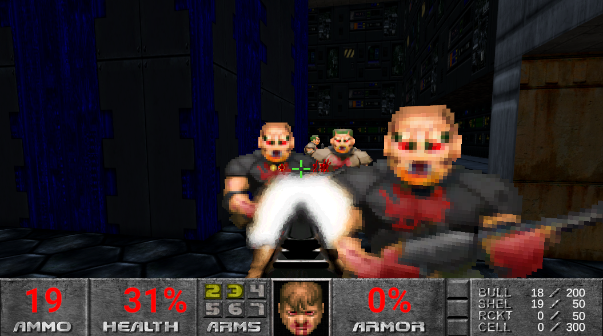
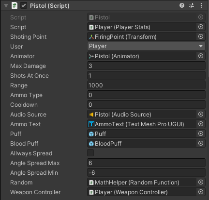
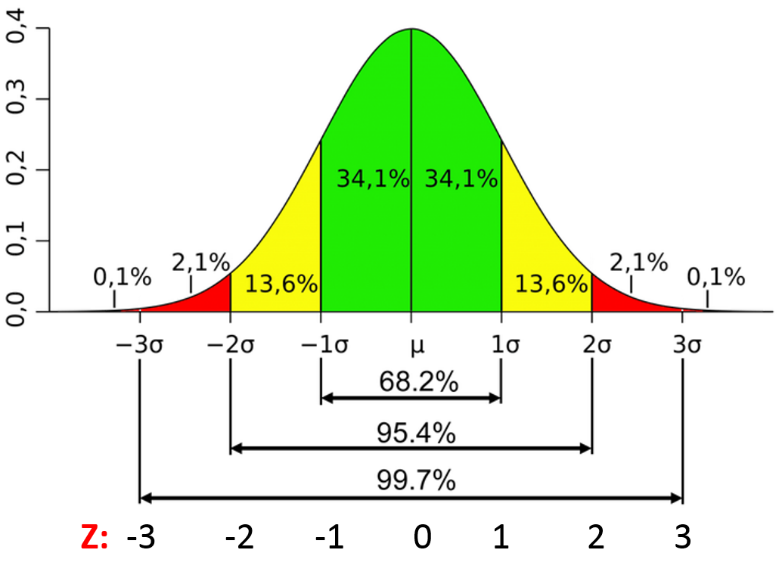
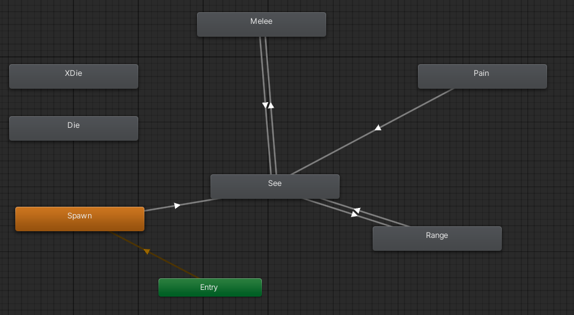

<h3>A short video showing how the project works (Lags are by my poor laptop.)</h3>
<video width="80%" controls>
  <source src="../img/doom/doommovie.mp4" type="video/mp4">
</video>

<h3>Introduction</h3>
I prepared the project I was doing during the vacations. It was my first big project done in unity. All elements of the game, except graphics and sounds are made by me. The game consists of the following elements:
<ul>
<li>Weapon system (so far I have implemented two)</li>
<li>AI of opponents done with FSM</li>
<li>Ability to take pick ups (health, armor)</li>
<li>Door mechanics that can be freely opened by pressing the spacebar</li>
<li>Self-created 3D level model using Probuilder</li>
<li>Self-created animations</li>
<li>Interactive UI</li>
</ul>

<h3>Weapons system</h3>

To handle hitscan weapons, I wrote a very versatile script in which you can edit, among other things: range, damage, number of shots fired at once, cooldown between shots, the type of ammunition the weapon should shoot, the effect of the shot, the effect of hitting the enemy, sound and angles. <a href="https://github.com/MyKarcio123/Doom1993/blob/main/Assets/Scripts/WeaponController.cs">Link</a>

The most interesting thing I learned in setting up the shooting system is to calculate the spread fairly. Delving into how the spread is calculated in the orginal version of the game, I learned that it uses a normal distribution, and I immediately saw that this is a brilliant idea. Thanks to the normal distribution, we are guaranteed a fairly (for the player) caluclated scatter. Most of the shots aimed at opponents will hit (with a probability of about 68-95%, depends on the width of the opponent and the sigma we set). The others will be misses. With a normal draw, with a uniform distribution, the probability of spread is hard to balance so that it gives pleasure to the player, which is, after all, what we want! <a href="https://github.com/MyKarcio123/Doom1993/blob/main/Assets/Scripts/RandomFunction.cs">Link</a>

<h3>AI</h3>
The AI I prepared is a very simple version of the FSM. Based on a reaserch I did, the first doom games used FSM, they had several states defined and depending on certain conditions they would switch between them. My implementation contains the same states ( i.e. Die, XDie, Melee, Pain, Range, See, Spawn). If you have played Doom you probably know what each state looks like. Also, I mapped the feature that when you shoot, there is a defined chance that the opponent will enter the Pain state, in which there will be an animation of pain from the shot, and it will give you a few seconds for extra shots! In addition, I used navmesh for pathfinding. <a href="https://github.com/MyKarcio123/Doom1993/tree/main/Assets/Scripts/EnemyAi">Link</a>

<h3>Graphic effects</h3>
All graphic effects such as animation, UI, level I recommend testing in the game itself :)

<a href="https://github.com/MyKarcio123/Doom1993"><i class="large github icon "></i>Source</a>

