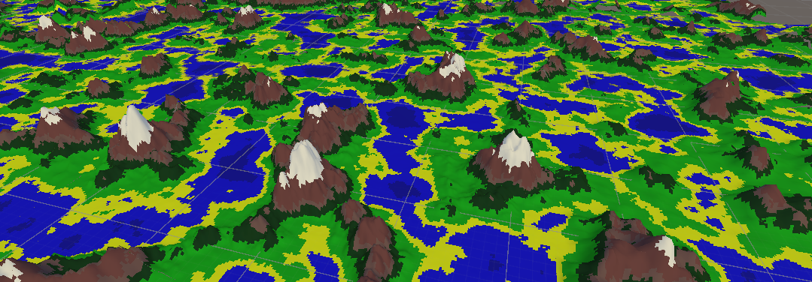
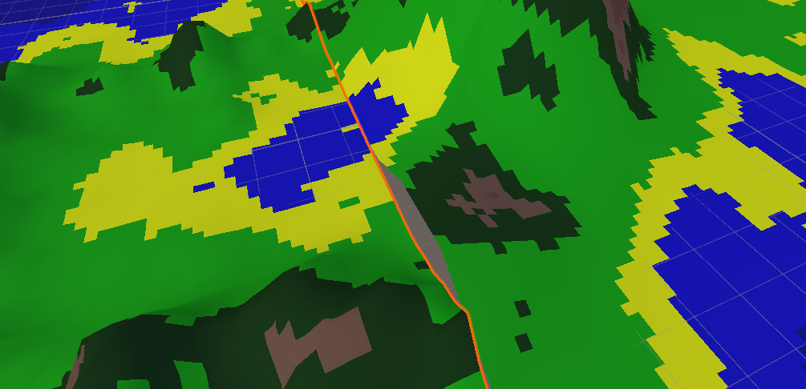
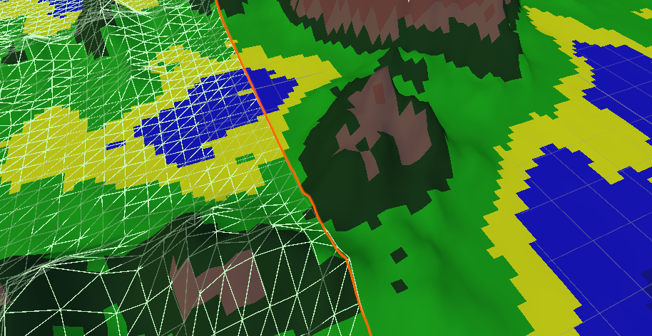

<h3>Introduction</h3>
I prepared a program in unity3D to deal with procedural generation of worlds. The algorithm I am using for this is perlin noise.Another problem I had to deal with was creating this to make the world truly infinite. Important in this project is memory management, because for a moment of inattention you can quickly consume all available memory making the game/program completely unusable.

<h2>Memory management</h2>

In order to have the greatest control over memory, the whole world, the whole mesh is created manually, by the program. First, a rectangular chunk of size n:n:x is created, inside of which, based on the results of Perlin Noise, our triangular mesh is created, only on the surface side. Then only chunks within the field of view that is defined are displayed, and all chunks are stored in a dictionary, so we are only limited by the maximum capacity of the dictionary.

<h2>"Infinite" world</h2>
I use perlin noise to generate my map. In a nutshell, perlin noise is created by linear interpolation dot product of random gradient vectors.
	@@ -29,16 +31,14 @@ I use perlin noise to generate my map. In a nutshell, perlin noise is created by
Already knowing more or less what perlin noise is, it is smooth, its values pass smoothly and are in the range, for example, from 0 to 1, we can define its parameters so as to get the map we are interested in. We can enter the seedy, change the offset, change the number of octaves, frequency, amplitude. All this translates into our final result which is a finished world.
<a href="https://libnoise.sourceforge.net/glossary/index.html#perlinnoise">More about Perlin Noise</a>

<h2>Holes between chunks</h2>

Another problem I have encountered is that the edges of the chunks do not always match. This is because the perlin noise rarely reaches its minimum and maximum at the given settings, so within the whole chunk I linearly interpolate it. The first solution as we think of to get rid of the holes is simply to globally pass and check the minimum and maximum, but this approach has its drawbacks. Due to the fact that the world is "infinite" we may not be able to that one maximum and minimum. Therefore, I apply the search for the minimum and maximum within all chunks within distance n from the player. 
In the first screenshot, the player is fairly far away from these two chunks, which is why there is a hole between them (also because of the reduction of their LOD, in a nutshell, the grid of further chunks is made of fewer triangles, since the player is not able to notice the difference from a distance anyway, and less memory is consumed). As you can see in the second screenshot when the player is closer we calculate their minimum and maximum and increase their LOD so the hole is no longer there, it overlaps.

As you can see, the terrain has changed a bit so the first screen had to be taken from a long distance by which the program did not draw as much attention to the terrain.Also in the second screenshot, you can see the collision grid that is added to the closer chunks so that it does not consume too much computation.

<a href="https://github.com/MyKarcio123/ProceduralGeneraterWorld"><i class="large github icon "></i>Source</a>